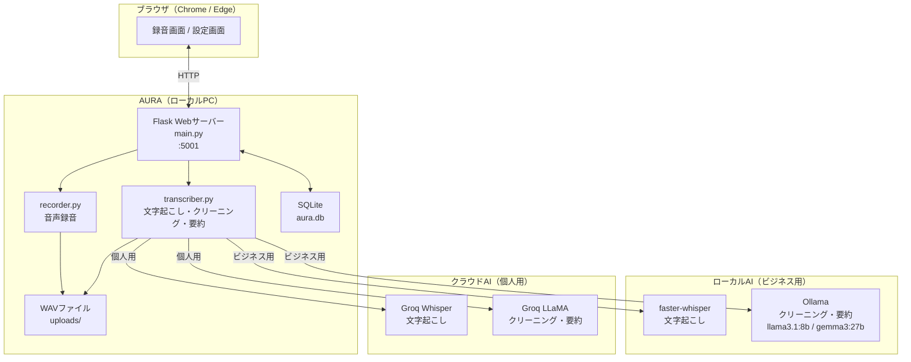
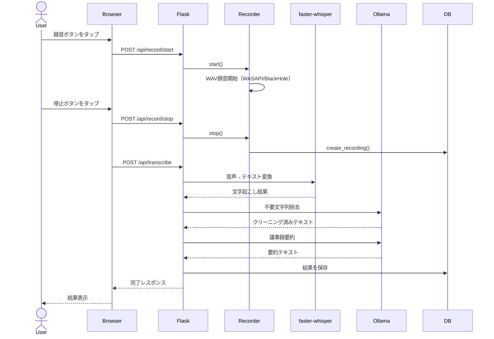
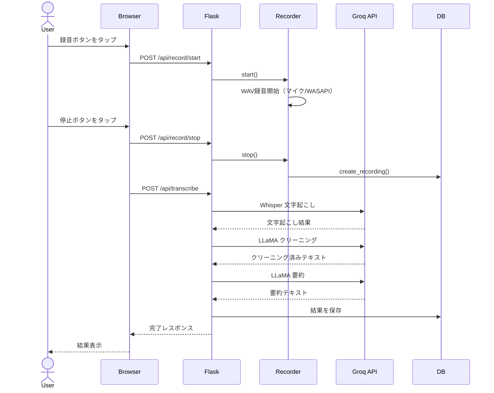

# システム構成・アーキテクチャ

## 概要

AURAはローカルで動作するWebアプリケーションです。FlaskがWebサーバーとして動作し、ユーザーはブラウザからアクセスします。音声処理・AI処理はすべてローカルマシン上で実行されます。

---

## システム構成図



---

## 技術スタック

| レイヤー | 技術 | バージョン | 役割 |
|---|---|---|---|
| Webフレームワーク | Flask | 3.1以上 | APIサーバー・ルーティング |
| 音声録音（マイク） | sounddevice | 0.5以上 | マイク入力録音 |
| 音声録音（システム音声・Windows） | pyaudiowpatch | 0.2以上 | WASAPIループバック録音 |
| 音声録音（システム音声・Mac） | sounddevice + BlackHole | - | BlackHole経由録音 |
| 文字起こし（個人用） | Groq API Whisper | - | クラウド音声認識 |
| 文字起こし（ビジネス用） | faster-whisper | 1.2以上 | ローカル音声認識 |
| GPU高速化 | PyTorch CUDA | 2.6以上 | faster-whisper GPU処理 |
| クリーニング・要約（個人用） | Groq API LLaMA | - | クラウドLLM |
| クリーニング・要約（ビジネス用） | Ollama | 0.18以上 | ローカルLLM |
| データベース | SQLite3 | 標準ライブラリ | 録音データ永続化 |
| パッケージング | PyInstaller | 6.0以上 | .exe/.app生成 |
| パッケージ管理 | uv | 最新 | 依存管理・仮想環境 |

---

## 処理フロー

### ビジネス用モード（完全ローカル）



### 個人用モード（クラウド処理）



---

## ディレクトリ構成

```
aura/
├── main.py                    Flaskアプリ・APIエンドポイント
├── aura.spec                  PyInstallerビルド設定
├── build.ps1                  Windowsビルドスクリプト
├── pyproject.toml             依存パッケージ定義
├── .env                       環境変数（gitignore）
├── .env.example               環境変数サンプル
├── README.md                  プロジェクト概要
├── SECURITY.md                セキュリティポリシー
├── LICENSE                    MITライセンス
├── app/
│   ├── database.py            SQLiteデータベース操作
│   ├── aura.db                SQLiteデータベース（gitignore）
│   └── services/
│       ├── recorder.py        音声録音サービス
│       └── transcriber.py     文字起こし・クリーニング・要約サービス
├── app/templates/
│   ├── index.html             録音画面
│   └── settings.html          設定画面
├── app/static/
│   ├── css/style.css          スタイルシート
│   ├── js/recorder.js         録音画面スクリプト
│   ├── js/settings.js         設定画面スクリプト
│   ├── aura.ico               アプリアイコン
│   ├── aura_icon_256.png      アイコン（256px）
│   └── aura_icon_512.png      アイコン（512px）
├── uploads/                   録音WAVファイル（gitignore）
└── docs/                      ドキュメント
    ├── ARCHITECTURE.md        システム構成（本ファイル）
    ├── DATABASE.md            DB設計
    ├── API.md                 APIエンドポイント仕様
    ├── FLOW.md                アクティビティ図・状態遷移図
    ├── SCREENS.md             画面設計
    ├── INSTALL.md             インストール手順
    ├── USAGE.md               使い方
    └── BUILD.md               ビルド・開発者向け情報
```

---

## 動作環境

| 項目 | Windows | Mac |
|---|---|---|
| OS | Windows 10/11 | macOS 12以降 |
| ポート | 5001 | 5001 |
| システム音声録音 | pyaudiowpatch（追加設定不要） | BlackHole（要インストール） |
| faster-whisper | ✅ 対応 | Apple Siliconのみ対応 |
| GPU高速化 | CUDA対応GPU | Metal（自動） |
