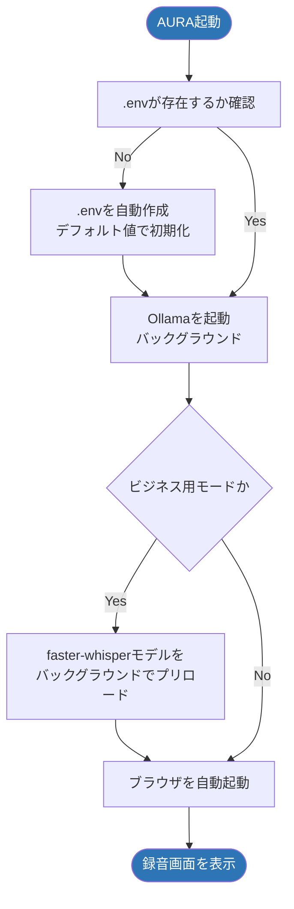
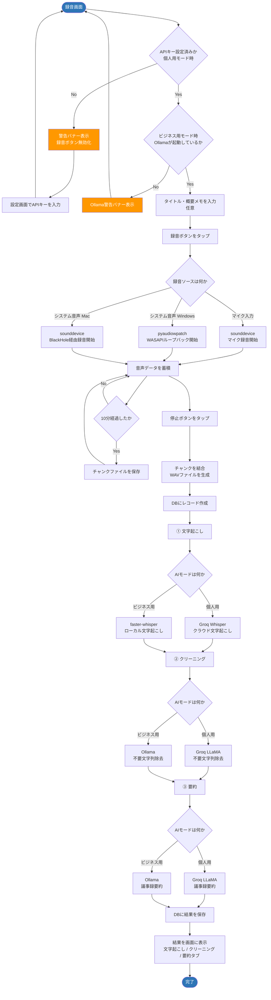
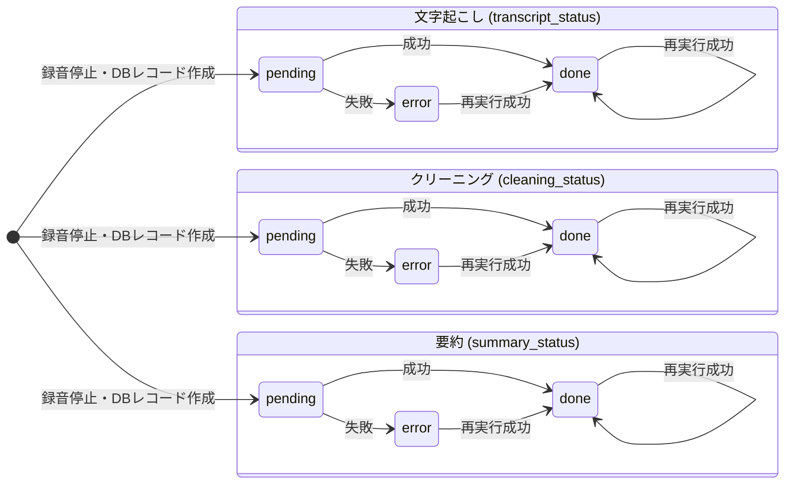
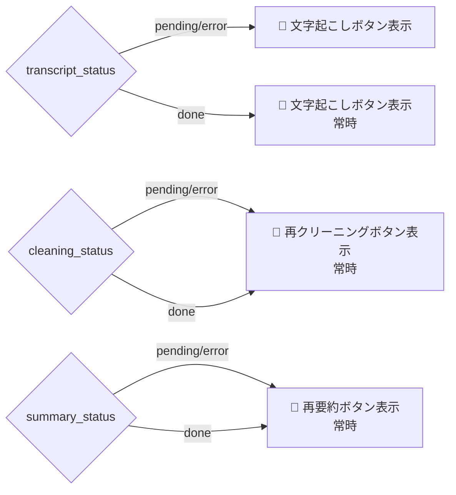
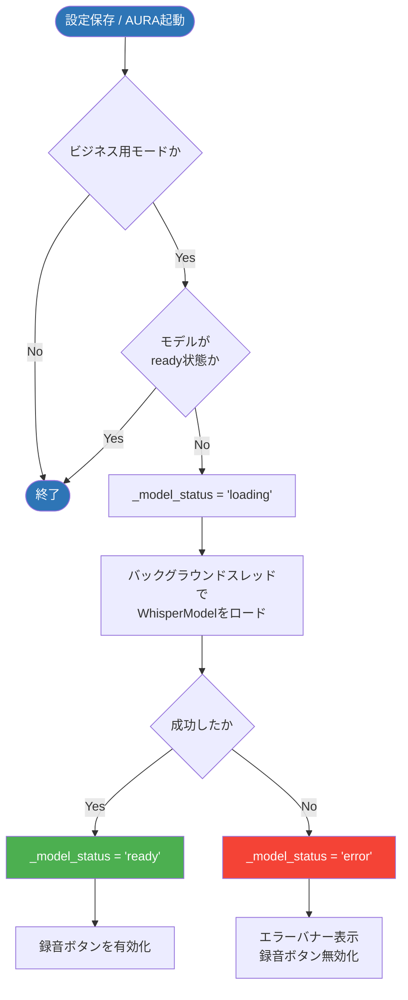

# アクティビティ図・状態遷移図

## 1. アプリケーション起動フロー

```mermaid
flowchart TD
    A([AURA起動]) --> B[.envが存在するか確認]
    B -- No --> C[.envを自動作成\nデフォルト値で初期化]
    C --> D
    B -- Yes --> D[Ollamaを起動\nバックグラウンド]
    D --> E{ビジネス用モードか}
    E -- Yes --> F[faster-whisperモデルを\nバックグラウンドでプリロード]
    F --> G
    E -- No --> G[ブラウザを自動起動]
    G --> H([録音画面を表示])

    style A fill:#2E75B6,color:#fff
    style H fill:#2E75B6,color:#fff
```

---

## 2. 録音〜処理完了フロー

```mermaid
flowchart TD
    A([録音画面]) --> B{APIキー設定済みか\n個人用モード時}
    B -- No --> C[警告バナー表示\n録音ボタン無効化]
    C --> D[設定画面でAPIキーを入力]
    D --> A

    B -- Yes --> E{ビジネス用モード時\nOllamaが起動しているか}
    E -- No --> F[Ollama警告バナー表示]
    F --> A
    E -- Yes --> G[タイトル・概要メモを入力\n任意]

    G --> H[録音ボタンをタップ]
    H --> I{録音ソースは何か}

    I -- マイク入力 --> J[sounddevice\nマイク録音開始]
    I -- システム音声 Windows --> K[pyaudiowpatch\nWASAPIループバック開始]
    I -- システム音声 Mac --> L[sounddevice\nBlackHole経由録音開始]

    J --> M[音声データを蓄積]
    K --> M
    L --> M

    M --> N{10分経過したか}
    N -- Yes --> O[チャンクファイルを保存]
    O --> M
    N -- No --> M

    M --> P[停止ボタンをタップ]
    P --> Q[チャンクを結合\nWAVファイルを生成]
    Q --> R[DBにレコード作成]

    R --> S[① 文字起こし]
    S --> T{AIモードは何か}

    T -- 個人用 --> U[Groq Whisper\nクラウド文字起こし]
    T -- ビジネス用 --> V[faster-whisper\nローカル文字起こし]

    U --> W[② クリーニング]
    V --> W

    W --> X{AIモードは何か}
    X -- 個人用 --> Y[Groq LLaMA\n不要文字列除去]
    X -- ビジネス用 --> Z[Ollama\n不要文字列除去]

    Y --> AA[③ 要約]
    Z --> AA

    AA --> AB{AIモードは何か}
    AB -- 個人用 --> AC[Groq LLaMA\n議事録要約]
    AB -- ビジネス用 --> AD[Ollama\n議事録要約]

    AC --> AE[DBに結果を保存]
    AD --> AE

    AE --> AF[結果を画面に表示\n文字起こし / クリーニング / 要約タブ]
    AF --> AG([完了])

    style A fill:#2E75B6,color:#fff
    style AG fill:#2E75B6,color:#fff
    style C fill:#FF9800,color:#fff
    style F fill:#FF9800,color:#fff
```

---

## 3. 録音データのステータス遷移

```mermaid
stateDiagram-v2
    direction LR

    [*] --> T_pending : 録音停止・DBレコード作成
    [*] --> C_pending : 録音停止・DBレコード作成
    [*] --> S_pending : 録音停止・DBレコード作成

    state "文字起こし (transcript_status)" as transcript {
        T_pending : pending
        T_done : done
        T_error : error

        T_pending --> T_done : 成功
        T_pending --> T_error : 失敗
        T_error --> T_done : 再実行成功
        T_done --> T_done : 再実行成功
    }

    state "クリーニング (cleaning_status)" as cleaning {
        C_pending : pending
        C_done : done
        C_error : error

        C_pending --> C_done : 成功
        C_pending --> C_error : 失敗
        C_error --> C_done : 再実行成功
        C_done --> C_done : 再実行成功
    }

    state "要約 (summary_status)" as summary {
        S_pending : pending
        S_done : done
        S_error : error

        S_pending --> S_done : 成功
        S_pending --> S_error : 失敗
        S_error --> S_done : 再実行成功
        S_done --> S_done : 再実行成功
    }
```

---

## 4. 再実行ボタンの表示ロジック

```mermaid
flowchart LR
    A{transcript_status} -- pending/error --> B[🔄 文字起こしボタン表示]
    A -- done --> C[🔄 文字起こしボタン表示\n常時]

    D{cleaning_status} -- pending/error --> E[🧹 再クリーニングボタン表示\n常時]
    D -- done --> E

    F{summary_status} -- pending/error --> G[🔄 再要約ボタン表示\n常時]
    F -- done --> G
```

---

## 5. モデルプリロードフロー（ビジネス用モード）

```mermaid
flowchart TD
    A([設定保存 / AURA起動]) --> B{ビジネス用モードか}
    B -- No --> Z([終了])
    B -- Yes --> C{モデルが\nready状態か}
    C -- Yes --> Z
    C -- No --> D[_model_status = 'loading']
    D --> E[バックグラウンドスレッドで\nWhisperModelをロード]
    E --> F{成功したか}
    F -- Yes --> G[_model_status = 'ready']
    F -- No --> H[_model_status = 'error']
    G --> I[録音ボタンを有効化]
    H --> J[エラーバナー表示\n録音ボタン無効化]

    style A fill:#2E75B6,color:#fff
    style Z fill:#2E75B6,color:#fff
    style G fill:#4CAF50,color:#fff
    style H fill:#f44336,color:#fff
```
