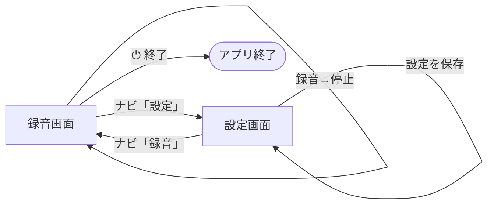

# 画面設計

## 画面一覧

| 画面ID | 画面名 | URL | 概要 |
|---|---|---|---|
| SCR-001 | 録音画面 | `/` | 録音・処理結果の表示・履歴管理 |
| SCR-002 | 設定画面 | `/settings` | AIモード・APIキー・録音ソースの設定 |

---

## SCR-001 録音画面

### 構成要素

| 要素 | 種別 | 説明 |
|---|---|---|
| ナビゲーションロゴ | 表示 | AURAアイコン＋ロゴ |
| 録音ボタン | ボタン | タップで録音開始・停止をトグル |
| 波形ビジュアライザー | アニメーション | 録音中の音声レベルをリアルタイム表示 |
| タイトル入力 | テキストボックス | 録音のタイトルを任意入力 |
| 概要メモ入力 | テキストエリア | 録音の概要・補足を任意入力 |
| 設定状態バッジ | 表示 | 現在の録音ソース・AIモードと注意事項 |
| 処理ステップ表示 | プログレス | ①文字起こし②クリーニング③要約の進捗 |
| 結果表示エリア | タブ表示 | 文字起こし / クリーニング済み / AI要約 |
| 過去の録音一覧 | アコーディオン | 保存済み録音の一覧・詳細表示 |
| APIキー未設定バナー | 警告 | 個人用モードでAPIキー未設定時に表示 |
| Ollama未起動バナー | 警告 | ビジネス用モードでOllama未起動時に表示 |
| ⏻ 終了ボタン | ボタン | AURAとOllamaを終了 |

### 録音履歴の各アイテム

| 要素 | 説明 |
|---|---|
| タイトル・日時 | 録音のタイトルと作成日時 |
| 編集フォーム | タイトル・メモを編集 |
| タブ切替 | 📝文字起こし / 🧹クリーニング済み / ✨AI要約 |
| 追加プロンプト入力 | 再要約への追加指示を入力 |
| 🔄 文字起こしボタン | 文字起こしを再実行 |
| 🧹 再クリーニングボタン | クリーニングを再実行 |
| 🔄 再要約ボタン | 要約を再実行 |
| 💾 保存ボタン | タイトル・メモの編集内容を保存 |
| 🗑️ 削除ボタン | 録音データを削除 |

---

## SCR-002 設定画面

### 個人用モード

### ビジネス用モード

### システム音声モード（Windows）

### 構成要素

| 要素 | 種別 | 説明 |
|---|---|---|
| AIモード選択 | カード選択 | 個人用（Groq API）/ ビジネス用（faster-whisper） |
| faster-whisper動作要件 | インフォメーション | ビジネス用選択時にGPU要件・DL容量を表示 |
| Groq APIキー入力 | パスワード入力 | APIキーを入力・表示/非表示トグル付き |
| Ollamaモデル選択 | ドロップダウン | インストール済みモデルを動的取得して表示 |
| モデルロード進捗 | プログレスバー | ビジネス用モード保存時のモデルロード状況 |
| 録音ソース選択 | カード選択 | マイク入力 / システム音声 |
| Windows案内 | インフォメーション | システム音声選択時に追加設定不要を表示 |
| BlackHoleガイド（Mac） | ステップガイド | Mac用BlackHoleインストール手順（5ステップ） |
| 設定を保存ボタン | ボタン | 設定を.envファイルに保存 |
| データ管理 | 危険操作エリア | 全録音データの一括削除 |

---

## 画面遷移

---

## 設定状態バッジ

録音画面の設定状態エリアに表示される情報です。

| 設定 | バッジ表示 | 注意事項 |
|---|---|---|
| マイク入力 | 🎤 マイク入力 | ⚠️ オンライン会議の音声は録音されません |
| システム音声 | 🖥️ システム音声 | 🔊 PCのすべての音声を録音します |
| 個人用（Groq API） | ⚡ 個人用（Groq API） | ☁️ 音声データはクラウドに送信されます |
| ビジネス用（faster-whisper） | 🏢 ビジネス用（faster-whisper） | 🔒 音声データは外部に送信されません |
